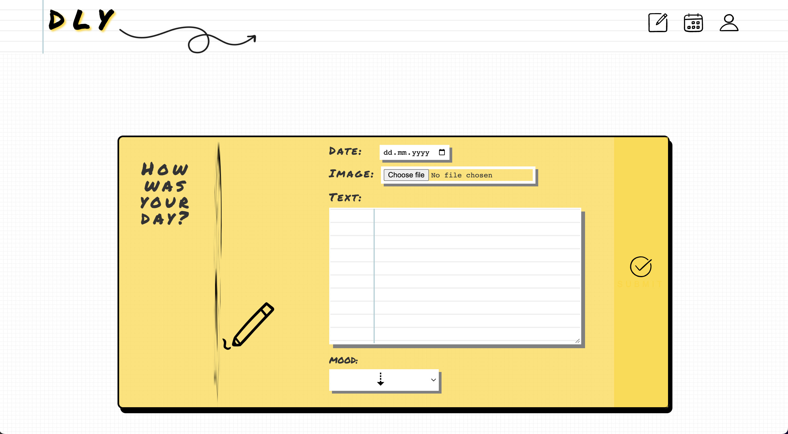
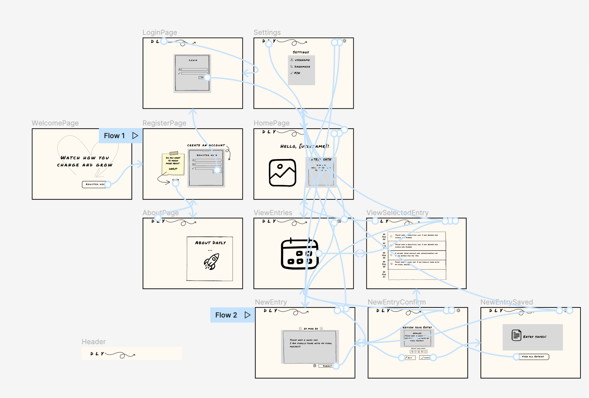

## ▶ Description

`DaiLy` is your daily diary ✍︎!

## ▶ Functionalities

- `Landing page`
- `Authentication: Register and login`
- `Personal userpage`
  - filter your favourite entries
  - logout
- `New entry`
  - select date
  - upload image
  - select your mood
- `Overview of all your entries`
  - edit / delete your entry
- `Logout page`

## ▶ Technologies

- Next.js
- React.js
- Postgres.js
- Emotion
- Jest (Unit tests)
- Playwright (E2E tests)
- TypeScript
- GitHub Actions
- Cloudinary

## ▶ Setup instructions

- Clone the repository with `git clone <repo>`
- Setup the database by downloading and installing PostgreSQL
- Create a user and a database
- Create a new file `.env`
- Copy the environment variables from `.env-example` into `.env`
- Replace the placeholders xxxxx with your username, password and name of database
- Install dotenv-cli with `yarn add dotenv-cli`
- Run `yarn install` in your command line
- Run the migrations with `yarn migrate up`
- Start the server by running `yarn dev`

## ▶ API key

- Set up account on <a href="cloudinary.com">cloudinary</a>
- Save your `Cloud Name` as `CLOUDINARY_NAME` in `.env` file

## ▶ Deploy on Fly.io

- Sign up on `Fly.io`
- On the `Fly.io Tokens page`, generate a new Fly.io access token named **GitHub Actions Deploy Token** and copy it from the text box that appears - **it will only be shown once**
- In your GitHub repo under `Settings → Secrets → Actions`, click the New repository secret button at the top right of the page and create a new token with the name FLY_API_TOKEN and the token you copied as the secret
- On the command line, log in to Fly.io using the following command and enter your credentials in the browser window that appears:

```
flyctl auth login
```

- Create an app, specifying the name using only lowercase letters and dashes:

```
flyctl apps create --name <app name>
```

- Create the Fly.io config files
- Add to your database/connect.ts:

```
if (!process.env.FLY_IO) config();
```

- Change your next.config.js to:

```
const nextConfig = {
  reactStrictMode: true,
  swcMinify: true,
  compiler: {
    emotion: true,
  },
};

module.exports = nextConfig;
```

- Add database credentials using `Fly.io secrets` (the credentials will be randomly generated for security):

```
flyctl secrets set PGHOST=localhost PGDATABASE=$(openssl rand -hex 16) PGUSERNAME=upleveled$(openssl rand -hex 16) PGPASSWORD=$(openssl rand -base64 32)
```

- If your app needs any additional environment variables such as API keys, also add them to the secrets using the following pattern:

```
flyctl secrets set <secret name>=<secret value>
```

- Create a 1GB volume for the PostgreSQL database in the Frankfurt region:

```
flyctl volumes create postgres --size 1 --region fra
```

- Deploy the first version of the app:

```
flyctl deploy
```

## ▶ Screenshots




## ▶ Drafts with Figma


